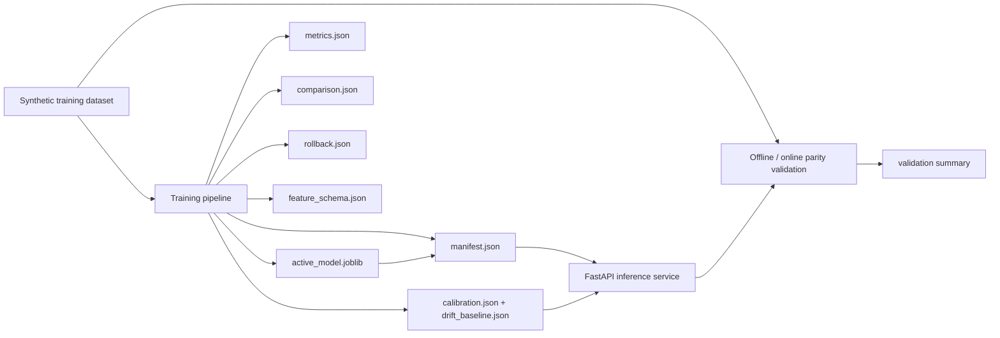

# ml-training-serving-platform

An end-to-end ML lifecycle platform that trains a credit-risk classifier, compares champion and challenger models, registers rollback and monitoring artifacts, serves multi-version predictions through FastAPI, and validates offline-to-online prediction parity before release.

## Problem

Many ML demos stop at model accuracy. Real ML engineering work requires reproducible training, versioned model packaging, and confidence that the numbers validated offline match what the inference API serves online. This repo focuses on that train-to-serve boundary so model releases stay debuggable, repeatable, and safe to ship.

## Architecture

The current implementation is intentionally compact but complete:

- a deterministic synthetic credit-risk dataset is generated locally
- training fits a deterministic champion/challenger pair on the generated dataset
- the registry writes active model, champion, challenger, feature schema, metrics, comparison, rollback, calibration, drift-baseline, and manifest artifacts under a versioned artifact directory
- FastAPI serves predictions from either the active model or an explicitly selected registered version
- a parity validator compares direct offline probabilities to served probabilities on a holdout slice
- a monitoring summary reports feature drift and model calibration gaps from the latest registered artifact set

In practice, the repo is split into three lifecycle stages: deterministic training data generation, artifact-backed champion/challenger registration, and serving-time validation that checks the API against the offline benchmark.

## Training, Serving, Validation

This repo is split into three separate code paths so the lifecycle is easy to inspect:

1. `app/dataset.py` generates and reloads the synthetic training data.
2. `app/training.py` fits both candidate models, selects the active model, and writes the comparison and rollback bundle.
3. `app/service.py` loads the saved manifest and serves predictions from the active artifact or a requested registered version.
4. `app/monitoring.py` builds drift and calibration summaries from the registered artifact set.
5. `app/validation.py` checks that offline probabilities and online probabilities stay aligned.
6. `app/main.py` exposes the FastAPI surface.
7. `app/cli.py` provides explicit `train`, `validate`, and `batch-score` commands.

That separation matters. This is not an "everything in one file" demo; it is a training artifact, a serving layer, a rollback record, and a parity check stitched together with a small, inspectable contract.



## Tradeoffs

This implementation makes three deliberate tradeoffs:

1. The dataset is synthetic so the repo remains runnable without private data or warehouse access.
2. The registry is filesystem-based instead of MLflow because the goal is lifecycle clarity before distributed platform overhead.
3. The model is a deterministic tree ensemble rather than a larger boosting stack so the training-serving path stays fast, reproducible, and easy to validate locally.

## Repo Layout

```text
ml-training-serving-platform/
├── app/
│   ├── cli.py
│   ├── config.py
│   ├── dataset.py
│   ├── main.py
│   ├── service.py
│   ├── training.py
│   └── validation.py
├── artifacts/
├── generated/
├── tests/
```

## Run Steps

### Install Dependencies

```bash
git clone https://github.com/srn91/ml-training-serving-platform.git
cd ml-training-serving-platform
python3 -m pip install -r requirements.txt
```

### Train and Register the Model

```bash
make train
```

That produces:

- `generated/credit_risk_dataset.csv`
- `artifacts/model-v1/active_model.joblib`
- `artifacts/model-v1/champion_model.joblib`
- `artifacts/model-v1/challenger_model.joblib`
- `artifacts/model-v1/metrics.json`
- `artifacts/model-v1/comparison.json`
- `artifacts/model-v1/rollback.json`
- `artifacts/model-v1/feature_schema.json`
- `artifacts/model-v1/calibration.json`
- `artifacts/model-v1/drift_baseline.json`
- `artifacts/model-v1/monitoring_summary.json`
- `artifacts/model-v1/manifest.json`

### Validate Offline-to-Online Parity

```bash
make train
make validate
```

`make validate` checks the already-registered artifact package and compares direct offline probabilities to the probabilities returned by the serving path. It does not retrain the model.

### Serve the Model

```bash
make train
make serve
```

Useful endpoints:

- `http://127.0.0.1:8000/health`
- `http://127.0.0.1:8000/model`
- `http://127.0.0.1:8000/models`
- `http://127.0.0.1:8000/monitoring`
- `http://127.0.0.1:8000/predict`
- `http://127.0.0.1:8000/predict/batch`
- `http://127.0.0.1:8000/docs`

Single-record and batch prediction routes also accept an optional `version` query parameter so you can score against a specific registered model:

```bash
curl -X POST "http://127.0.0.1:8000/predict?version=model-v1-challenger" \
  -H "Content-Type: application/json" \
  -d '{"income_k":72.0,"debt_to_income":0.31,"credit_score":690.0,"tenure_months":36.0,"late_payments_12m":1}'
```

### Batch Score Registered Holdout Records

```bash
make train
python3 -m app.cli batch-score --limit 3
```

You can also score a custom JSON payload:

```bash
python3 -m app.cli batch-score --input path/to/batch_records.json
```

Accepted input shapes:

- a top-level JSON array of records
- or `{"records": [...]}`

### Full Quality Gate

```bash
make verify
```

## Hosted Deployment

- Live URL: `https://ml-training-serving-platform.onrender.com`
- Click first: [`/model`](https://ml-training-serving-platform.onrender.com/model)
- Browser smoke: Render-hosted `/model` loaded in a real browser and returned the active artifact manifest, including the champion/challenger comparison and rollback metadata.
- Render service config: Python web service on `main`, auto-deploy on commit, region `oregon`, plan `free`, build `pip install -r requirements.txt && python3 -m app.cli train`, start `uvicorn app.main:app --host 0.0.0.0 --port $PORT`, health check `/health`.
- Render deploy command: `render deploys create srv-d7n658brjlhs73aaqqt0 --confirm`

## Cloud and Infrastructure Assets

The repo includes deployment assets for the inference API path:

- `Dockerfile` for containerized training + serving
- `render.yaml` for the hosted demo service
- `infra/kubernetes/` for a small Deployment + Service
- `infra/aws/ecs-task-definition.json` for an ECS/Fargate-style deployment
- `infra/azure/container-app.yaml` for Azure Container Apps

These assets package the same FastAPI service and its artifact-backed startup flow. They do not replace the local training pipeline; they wrap it in deployable service definitions.

## Validation

The repo currently verifies:

- the training pipeline writes champion, challenger, comparison, rollback, schema, metrics, and manifest artifacts
- the training pipeline also writes calibration, drift-baseline, and monitoring artifacts
- the selected active model clears a reasonable local demo quality bar
- the FastAPI serving surface returns the active model version and a bounded probability
- the FastAPI serving surface exposes the registered model inventory and monitoring summary
- single-record and batch inference can route to a specific registered model version
- offline direct probabilities match the served probabilities on a holdout sample
- batch scoring uses the same registered artifact as the single-record API path

The public story should stay precise:

- training and serving are separate code paths
- the service always loads from the active artifact package
- validation compares offline and online probabilities instead of assuming they match
- the manifest, schema, comparison, rollback, and metrics files make the artifact bundle self-describing

Current validation shape:

- training rows: `1920`
- test rows: `480`
- the selected active model is recorded in the manifest and comparison file
- max offline-online probability delta stays at or below `1e-6`
- monitoring summaries record feature drift and per-model calibration gaps from the latest evaluation slice

Local quality gates:

- `make lint`
- `make test`
- `make validate`
- `make verify`

## Current Capabilities

The current implementation supports:

- deterministic training dataset generation
- scikit-learn champion/challenger training with reproducible model versioning
- artifact registration with metrics, schema, comparison, rollback, calibration, drift-baseline, and manifest metadata
- FastAPI inference serving from the selected active model or an explicitly requested registered version
- monitoring summaries that surface feature drift and calibration gaps
- offline-to-online parity validation for serving correctness
- batch scoring through both `POST /predict/batch` and `python3 -m app.cli batch-score`
