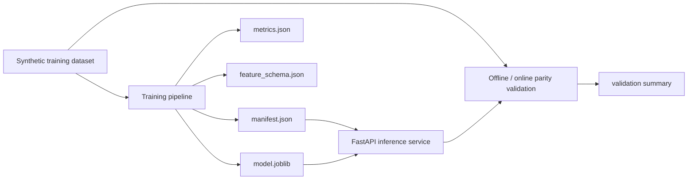

# ml-training-serving-platform

A local-first ML lifecycle repo that trains a credit-risk classifier, registers model artifacts and schema metadata, serves predictions through FastAPI, and validates offline-to-online prediction parity before publish.

## Problem

Many ML demos stop at model accuracy. Real ML engineering work requires a full lifecycle: reproducible training, artifact registration, version-aware serving, and confidence that the numbers used offline match what the inference API serves online. This repo focuses on that train-to-serve boundary.

## Architecture

The V1 implementation is intentionally compact but complete:

- a deterministic synthetic credit-risk dataset is generated locally
- training fits a deterministic tree-ensemble baseline on the generated dataset
- the registry writes model artifacts, feature schema, metrics, and a manifest under a versioned artifact directory
- FastAPI serves predictions from the latest registered model
- a parity validator compares direct offline probabilities to served probabilities on a holdout slice



## Tradeoffs

This V1 makes three deliberate tradeoffs:

1. The dataset is synthetic so the repo remains runnable without private data or warehouse access.
2. The registry is filesystem-based instead of MLflow because the goal is lifecycle clarity before distributed platform overhead.
3. The model is a deterministic tree ensemble rather than a larger boosting stack so the training-serving path stays fast, reproducible, and easy to validate locally.

## Repo Layout

```text
ml-training-serving-platform/
├── app/
│   ├── cli.py
│   ├── config.py
│   ├── dataset.py
│   ├── main.py
│   ├── service.py
│   ├── training.py
│   └── validation.py
├── artifacts/
├── generated/
├── tests/
```

## Run Steps

### Install Dependencies

```bash
git clone https://github.com/srn91/ml-training-serving-platform.git
cd ml-training-serving-platform
python3 -m pip install -r requirements.txt
```

### Train and Register the Model

```bash
make train
```

That produces:

- `generated/credit_risk_dataset.csv`
- `artifacts/model-v1/model.joblib`
- `artifacts/model-v1/metrics.json`
- `artifacts/model-v1/feature_schema.json`
- `artifacts/model-v1/manifest.json`

### Validate Offline-to-Online Parity

```bash
make train
make validate
```

`make validate` checks the already-registered artifact package and compares direct offline probabilities to the probabilities returned by the serving path. It does not retrain the model.

### Serve the Model

```bash
make train
make serve
```

Useful endpoints:

- `http://127.0.0.1:8000/health`
- `http://127.0.0.1:8000/model`
- `http://127.0.0.1:8000/docs`

### Full Quality Gate

```bash
make verify
```

## Validation

The repo currently verifies:

- the training pipeline writes a versioned model registry package
- the trained model clears a reasonable local demo quality bar
- the FastAPI serving surface returns the registered model version and a bounded probability
- offline direct probabilities match the served probabilities on a holdout sample

Expected local validation snapshot:

- training rows: `1920`
- test rows: `480`
- accuracy: `0.7896`
- ROC AUC: `0.8345`
- brier score: `0.1552`
- max offline-online probability delta: `4.8e-07`

Local quality gates:

- `make lint`
- `make test`
- `make validate`
- `make verify`

## Current Capabilities

The current V1 supports:

- deterministic training dataset generation
- scikit-learn training with reproducible model versioning
- artifact registration with metrics, schema, and manifest metadata
- FastAPI inference serving from the latest registered model
- offline-to-online parity validation for serving correctness

## Next Steps

Realistic next follow-up work:

1. add champion-challenger model comparison and rollback metadata
2. expose batch scoring and shadow validation endpoints
3. add drift and calibration monitoring outputs
4. support multiple model versions in the service with explicit routing
5. replace synthetic data with warehouse-backed feature snapshots
