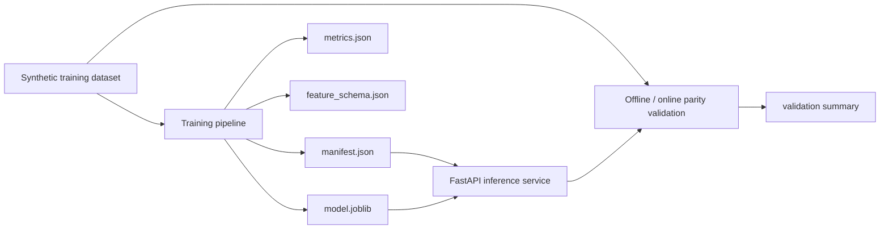

# ml-training-serving-platform

An end-to-end ML lifecycle platform that trains a credit-risk classifier, registers versioned artifacts and schema metadata, serves predictions through FastAPI, and validates offline-to-online prediction parity before release.

## Problem

Many ML demos stop at model accuracy. Real ML engineering work requires reproducible training, versioned model packaging, and confidence that the numbers validated offline match what the inference API serves online. This repo focuses on that train-to-serve boundary so model releases stay debuggable, repeatable, and safe to ship.

## Architecture

The V1 implementation is intentionally compact but complete:

- a deterministic synthetic credit-risk dataset is generated locally
- training fits a deterministic tree-ensemble baseline on the generated dataset
- the registry writes model artifacts, feature schema, metrics, and a manifest under a versioned artifact directory
- FastAPI serves predictions from the latest registered model
- a parity validator compares direct offline probabilities to served probabilities on a holdout slice

In practice, the repo is split into three lifecycle stages: deterministic training data generation, artifact-backed model registration, and serving-time validation that proves the API matches the offline benchmark.

## Training, Serving, Validation

This repo is split into three separate code paths so the lifecycle is easy to inspect:

1. `app/dataset.py` generates and reloads the synthetic training data.
2. `app/training.py` fits the model and writes the registry package.
3. `app/service.py` loads the saved manifest and serves predictions from the latest artifact.
4. `app/validation.py` checks that offline probabilities and online probabilities stay aligned.
5. `app/main.py` exposes the FastAPI surface.
6. `app/cli.py` provides explicit `train` and `validate` commands.

That separation matters. This is not an "everything in one file" demo; it is a training artifact, a serving layer, and a parity check stitched together with a small, inspectable contract.



## Tradeoffs

This V1 makes three deliberate tradeoffs:

1. The dataset is synthetic so the repo remains runnable without private data or warehouse access.
2. The registry is filesystem-based instead of MLflow because the goal is lifecycle clarity before distributed platform overhead.
3. The model is a deterministic tree ensemble rather than a larger boosting stack so the training-serving path stays fast, reproducible, and easy to validate locally.

## Repo Layout

```text
ml-training-serving-platform/
├── app/
│   ├── cli.py
│   ├── config.py
│   ├── dataset.py
│   ├── main.py
│   ├── service.py
│   ├── training.py
│   └── validation.py
├── artifacts/
├── generated/
├── tests/
```

## Run Steps

### Install Dependencies

```bash
git clone https://github.com/srn91/ml-training-serving-platform.git
cd ml-training-serving-platform
python3 -m pip install -r requirements.txt
```

### Train and Register the Model

```bash
make train
```

That produces:

- `generated/credit_risk_dataset.csv`
- `artifacts/model-v1/model.joblib`
- `artifacts/model-v1/metrics.json`
- `artifacts/model-v1/feature_schema.json`
- `artifacts/model-v1/manifest.json`

### Validate Offline-to-Online Parity

```bash
make train
make validate
```

`make validate` checks the already-registered artifact package and compares direct offline probabilities to the probabilities returned by the serving path. It does not retrain the model.

### Serve the Model

```bash
make train
make serve
```

Useful endpoints:

- `http://127.0.0.1:8000/health`
- `http://127.0.0.1:8000/model`
- `http://127.0.0.1:8000/predict`
- `http://127.0.0.1:8000/predict/batch`
- `http://127.0.0.1:8000/docs`

### Batch Score Registered Holdout Records

```bash
make train
python3 -m app.cli batch-score --limit 3
```

You can also score a custom JSON payload:

```bash
python3 -m app.cli batch-score --input path/to/batch_records.json
```

Accepted input shapes:

- a top-level JSON array of records
- or `{"records": [...]}`

### Full Quality Gate

```bash
make verify
```

## Hosted Deployment

- Live URL: `https://ml-training-serving-platform.onrender.com`
- Click first: [`/model`](https://ml-training-serving-platform.onrender.com/model)
- Browser smoke: Render-hosted `/model` loaded in a real browser and returned the active artifact manifest for `model-v1`.
- Render service config: Python web service on `main`, auto-deploy on commit, region `oregon`, plan `free`, build `pip install -r requirements.txt && python3 -m app.cli train`, start `uvicorn app.main:app --host 0.0.0.0 --port $PORT`, health check `/health`.
- Render deploy command: `render deploys create srv-d7n658brjlhs73aaqqt0 --confirm`

## Validation

The repo currently verifies:

- the training pipeline writes a versioned model registry package
- the trained model clears a reasonable local demo quality bar
- the FastAPI serving surface returns the registered model version and a bounded probability
- offline direct probabilities match the served probabilities on a holdout sample
- batch scoring uses the same registered artifact as the single-record API path

The public story should stay precise:

- training and serving are separate code paths
- the service always loads from the registered artifact package
- validation compares offline and online probabilities instead of assuming they match
- the manifest, schema, and metrics files make the artifact bundle self-describing

Expected local validation snapshot:

- training rows: `1920`
- test rows: `480`
- accuracy: `0.7896`
- ROC AUC: `0.8345`
- brier score: `0.1552`
- max offline-online probability delta: `4.8e-07`

Local quality gates:

- `make lint`
- `make test`
- `make validate`
- `make verify`

## Current Capabilities

The current V1 supports:

- deterministic training dataset generation
- scikit-learn training with reproducible model versioning
- artifact registration with metrics, schema, and manifest metadata
- FastAPI inference serving from the latest registered model
- offline-to-online parity validation for serving correctness
- batch scoring through both `POST /predict/batch` and `python3 -m app.cli batch-score`

## Next Steps

Realistic next follow-up work:

1. add champion-challenger model comparison and rollback metadata
2. add shadow validation outputs that compare current and candidate models on the same batch
3. add drift and calibration monitoring outputs
4. support multiple model versions in the service with explicit routing
5. replace synthetic data with warehouse-backed feature snapshots
