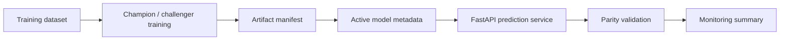

# ML Training Serving Platform - System Brief

## Problem

ML platforms break down when training artifacts, model versions, serving contracts, and monitoring outputs are handled manually. This project connects training, artifact registration, model selection, prediction serving, parity checks, and monitoring artifacts in one workflow.

## System Design



## Stack

- Python, FastAPI, pytest
- scikit-learn and PyTorch model artifacts
- Versioned artifact manifests and active model metadata
- Render-hosted read-only service

## Metrics

- Offline-online parity delta `<= 1e-6`
- Champion/challenger model comparison
- Multi-version serving metadata
- Monitoring summary emitted with model files and calibration artifacts

## Run

```bash
make setup
make train
make test
make serve
```

Live demo: https://ml-training-serving-platform.onrender.com

## Production Scale Improvements

- Store model metadata in a model registry service instead of local JSON manifests.
- Add deployment gates for calibration drift, latency, and parity checks.
- Add shadow traffic comparisons before switching champion versions.
- Move prediction logs into a warehouse table for model monitoring and auditability.
